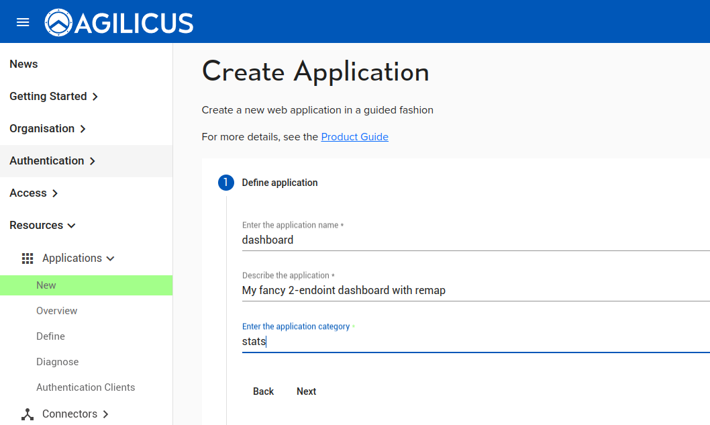

## flask-example

This is a simple dual-endpoint web application.

Usage:

```
docker-compose up
```

then open a browser to http://localhost:5000

on port 5000 it serves html. On port 5001 it serves an API, which
is rendered into the dashboard HTML.




